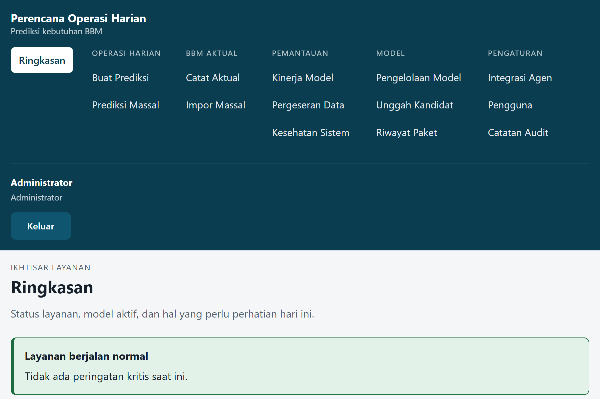
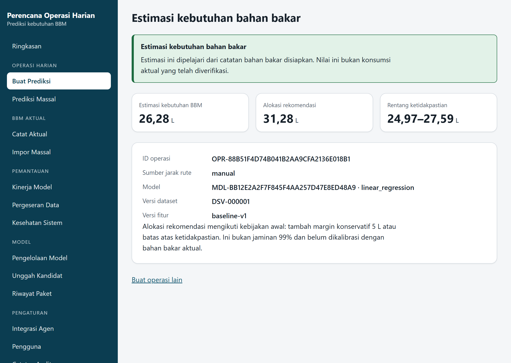
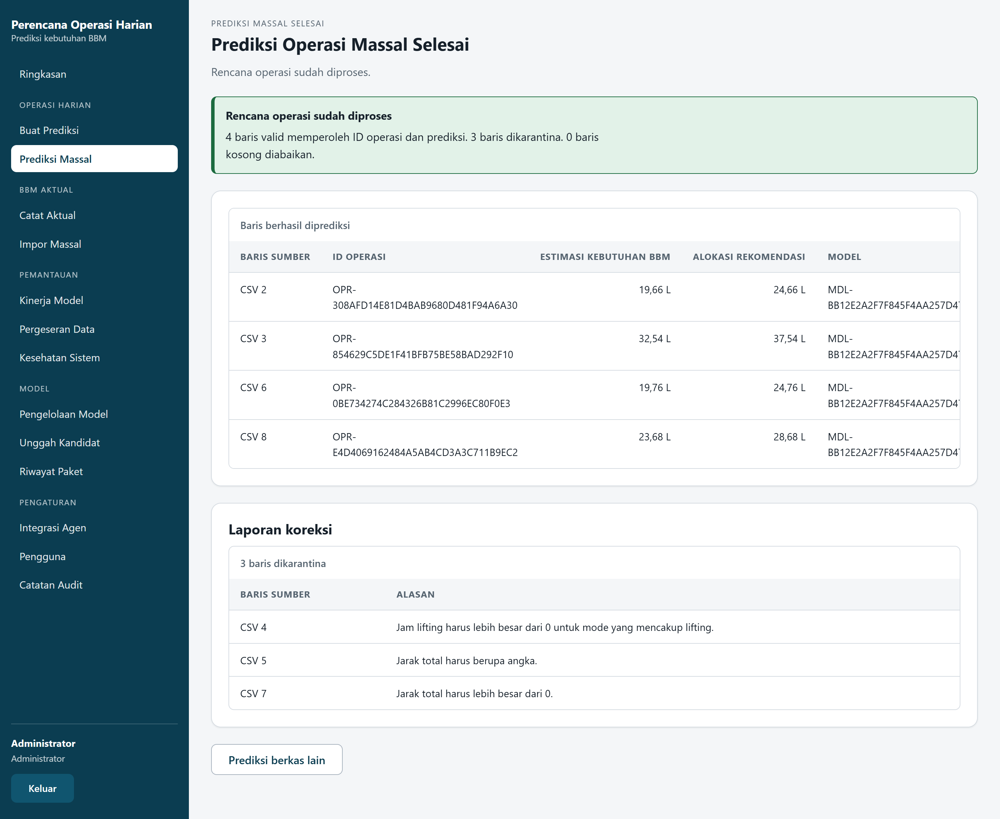
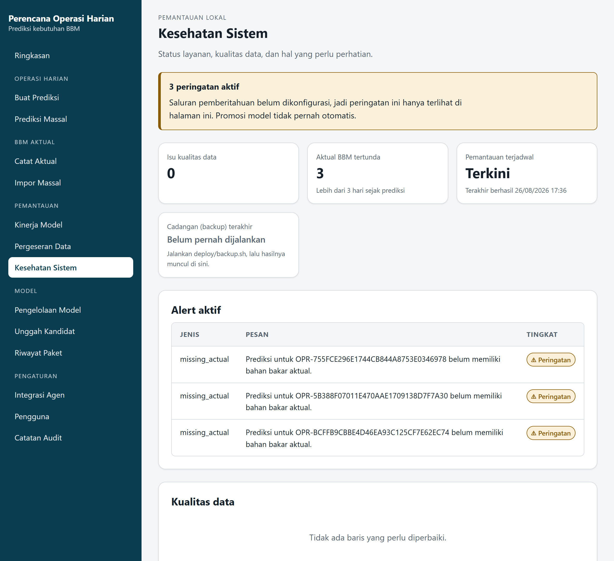
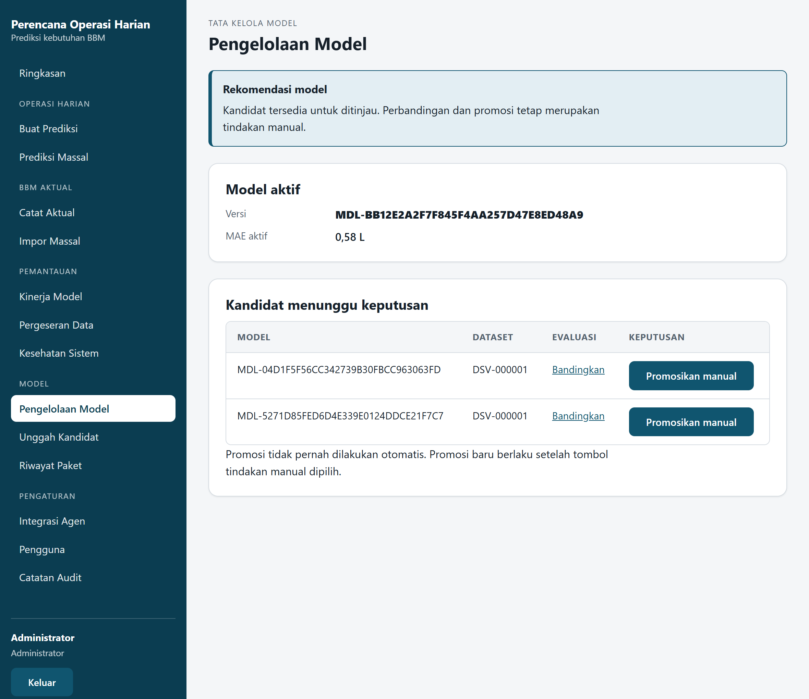

# Panduan Operator — Perencana Operasi Harian

Panduan ini untuk orang yang memakai aplikasi setiap hari. Tidak ada perintah teknis di sini.
Kalau ada langkah yang meminta Anda mengetik perintah, itu ada di
[runbook pemulihan](recovery-runbook.md) dan bukan tugas Anda.

> **Satu hal yang harus dipahami sebelum mulai.**
> Angka yang diberikan aplikasi ini adalah **perkiraan bahan bakar yang perlu disiapkan**,
> bukan catatan bahan bakar yang benar-benar terpakai. Angka itu membantu Anda menyiapkan,
> bukan menggantikan pencatatan aktual. Setiap prediksi selalu menampilkan kalimat ini juga.

---

## Daftar isi

1. [Masuk ke aplikasi](#1-masuk-ke-aplikasi)
2. [Membuat satu prediksi](#2-membuat-satu-prediksi)
3. [Membuat banyak prediksi sekaligus](#3-membuat-banyak-prediksi-sekaligus)
4. [Mencatat bahan bakar aktual](#4-mencatat-bahan-bakar-aktual)
5. [Membaca halaman Pemantauan](#5-membaca-halaman-pemantauan)
6. [Mengganti model](#6-mengganti-model)
7. [Mengelola kredensial agen](#7-mengelola-kredensial-agen)
8. [Kalau ada yang tidak beres](#8-kalau-ada-yang-tidak-beres)

---

## 1. Masuk ke aplikasi

1. Buka alamat aplikasi di peramban (Chrome, Edge, atau Firefox).
2. Isi nama pengguna dan kata sandi, lalu tekan **Masuk**.

Menu di sebelah kiri hanya menampilkan halaman yang boleh Anda buka. Kalau Anda tidak melihat
suatu menu, berarti peran akun Anda memang tidak mencakupnya — itu bukan kerusakan.

**Kalau kata sandi ditolak:** periksa huruf besar/kecil. Setelah beberapa kali gagal, sistem
menahan percobaan berikutnya sebentar. Tunggu, lalu coba lagi.

---

## 2. Membuat satu prediksi

1. Menu **Buat Prediksi**.
2. Isi:
   - **Kategori kendaraan** — pilih dari daftar.
   - **Mode aktivitas** — `transport`, `lifting`, atau `transport_and_lifting`.
   - **Jam lifting** — wajib diisi kalau mode mencakup lifting.
   - **Jarak total (km)** — jarak seluruh perjalanan.
   - **Sumber jarak** — `manual` kalau Anda mengetik sendiri.
3. Tekan **Simpan operasi harian**. Operasi tersimpan lebih dulu, jadi angkanya bisa
   ditelusuri kembali nanti.
4. Di halaman berikutnya (*Operasi harian tersimpan*), tekan
   **Buat estimasi kebutuhan BBM**.

Hasilnya menampilkan:

| Yang ditampilkan | Artinya |
|---|---|
| Perkiraan kebutuhan | Estimasi bahan bakar untuk operasi ini. |
| Rekomendasi alokasi | Perkiraan ditambah margin aman. **Angka inilah yang dipakai menyiapkan.** |
| Rentang ketidakpastian | Batas bawah dan atas yang masuk akal. Rentang lebar = model kurang yakin. |
| Model yang dipakai | Versi model yang menghitung. Berguna saat menelusuri angka lama. |

Perhatikan kotak hijau di atas: nilai ini **estimasi bahan bakar disiapkan**, bukan konsumsi aktual yang telah diverifikasi. Kalimat itu selalu ikut ditampilkan.

**Kalau muncul "Belum ada kandidat baseline terlatih":** belum ada model yang aktif.
Hubungi penanggung jawab model — lihat [bagian 6](#6-mengganti-model).

---

## 3. Membuat banyak prediksi sekaligus

1. Menu **Prediksi Massal**.
2. Unduh templat yang disediakan di halaman itu. **Selalu pakai templat itu**, jangan membuat
   kolom sendiri — urutan dan nama kolom harus persis.
3. Isi satu baris per operasi.
4. Unggah berkasnya.

Aplikasi memproses baris yang benar dan **menahan** baris yang bermasalah. Baris bermasalah
ditampilkan beserta alasannya, misalnya `Jam lifting harus lebih besar dari 0 untuk mode yang
mencakup lifting`.

Perbaiki baris tersebut di berkas asli, lalu unggah ulang. Baris yang sudah berhasil tidak
terhitung dua kali.

Kolom **Alasan** pada Laporan koreksi menyebutkan persis apa yang salah pada tiap baris, sehingga Anda tahu apa yang perlu diperbaiki di berkas sumber.

---

## 4. Mencatat bahan bakar aktual

Ini bagian yang paling sering terlewat, dan yang paling menentukan.

**Tanpa angka aktual, aplikasi tidak bisa mengukur seberapa tepat prediksinya.** Model bisa
memburuk berbulan-bulan tanpa ada yang tahu.

- **Satu per satu:** menu **Catat Aktual**, pilih operasinya, isi jumlah liter sebenarnya.
- **Sekaligus:** menu **Impor Massal**, pakai templatnya, sama seperti prediksi massal.

Lakukan ini rutin — mingguan sudah cukup.

---

## 5. Membaca halaman Pemantauan

Menu **Pemantauan**. Bagian yang perlu Anda perhatikan:

**Peringatan aktif.** Setiap peringatan menyebutkan tindakan yang perlu diambil. Ikuti
kalimat "Tindakan:" — kalimat itu memang ditulis untuk dibaca tanpa latar belakang teknis.

**Pergeseran fitur (drift).** Artinya pola operasi sekarang berbeda dari data yang dipakai
melatih model. **Ini belum tentu kesalahan.** Rute baru atau musim yang berbeda memang membuat
pergeseran. Yang perlu Anda tanyakan: _apakah memang ada yang berubah di lapangan?_
- Ya, dan akan berlanjut → minta model dilatih ulang.
- Tidak ada yang berubah → periksa dulu cara data dimasukkan.

Halaman ini selalu menyebutkan **berapa banyak data** yang dibandingkan. Kalau jumlahnya kecil,
kesimpulannya lemah — jangan mengambil keputusan besar dari situ.

**Kinerja model.** Dihitung dari operasi yang sudah punya angka aktual. Kalau tertulis data
belum cukup, itu jujur — bukan kerusakan. Isi lebih banyak angka aktual
([bagian 4](#4-mencatat-bahan-bakar-aktual)).

**Kesehatan Sistem.** Menunjukkan kapan pemantauan terakhir berhasil dan kapan pencadangan
terakhir berhasil. Kalau tertulis **Kedaluwarsa**, angka di halaman ini mungkin sudah lama —
hubungi penanggung jawab teknis.

Spanduk di atas juga memberi tahu apakah peringatan dikirim ke luar aplikasi. Bila tertulis *saluran pemberitahuan belum dikonfigurasi*, peringatan hanya terlihat di halaman ini — sampaikan ke penanggung jawab teknis.

---

## 6. Mengganti model

Hanya untuk akun dengan peran pengelola model.

**Mengunggah paket model baru:** menu **Unggah Kandidat**, pilih berkas `.zip` dari pembuat model.

Aplikasi memeriksa paket itu lebih dulu. Kalau ada yang tidak beres, paket **ditolak** dan
alasannya ditampilkan. Model yang sedang berjalan **tidak tersentuh** — mengunggah tidak pernah
mengganti model secara diam-diam.

**Mengaktifkan:** menu **Pengelolaan Model**, bandingkan kandidat, lalu tekan **Promosikan manual**
pada yang Anda pilih.

Kalau aktivasi gagal, model lama **tetap melayani prediksi**. Anda akan melihat pesan yang
menjelaskan sebabnya. Tidak ada yang perlu Anda pulihkan sendiri.

Kalau setelah aktivasi muncul pesan bahwa **pemeriksaan gagal**, model baru sudah terlanjur
melayani. Segera aktifkan kembali versi sebelumnya dari halaman yang sama, lalu hubungi
penanggung jawab teknis.

Tombol **Promosikan manual** adalah satu-satunya cara model berganti. Tidak ada promosi otomatis.

---

## 7. Mengelola kredensial agen

Hanya untuk akun administrator. Menu **Integrasi Agen**.

Ini untuk memberi akses kepada asisten AI atau sistem lain yang perlu membaca prediksi dan
pemantauan.

**Menerbitkan:** isi nama klien, centang cakupan yang diperlukan, tekan **Terbitkan**.

> **Kredensial hanya ditampilkan satu kali.** Salin saat itu juga. Sistem hanya menyimpan
> sidik digitalnya, jadi kredensial yang hilang **harus diterbitkan ulang** — tidak bisa
> dilihat kembali. Ini disengaja.

**Mencabut:** tekan **Cabut** pada baris klien tersebut. Berlaku seketika.

Berikan cakupan seperlunya saja. Satu klien yang dicabut tidak mengganggu klien lain.

---

## 8. Kalau ada yang tidak beres

| Yang Anda lihat | Yang perlu dilakukan |
|---|---|
| Halaman tidak terbuka sama sekali | Hubungi penanggung jawab teknis. Sebutkan jam kejadiannya. |
| "Sesi formulir sudah tidak berlaku" | Muat ulang halaman, isi lagi, kirim ulang. Halaman terbuka terlalu lama. |
| "Belum ada kandidat baseline terlatih" | Belum ada model aktif. Lihat [bagian 6](#6-mengganti-model). |
| Baris tertahan saat unggah | Perbaiki baris itu di berkas asli, unggah ulang. |
| Kesehatan Sistem "Kedaluwarsa" | Pemantauan berhenti berjalan. Hubungi penanggung jawab teknis. |
| Prediksi terasa jauh dari kenyataan | Catat aktualnya dulu, lalu lihat Pemantauan. Kalau MAE naik, minta model dilatih ulang. |

**Saat melapor, sebutkan tiga hal ini** — dengan ini masalah biasanya ketemu jauh lebih cepat:

1. Halaman apa yang sedang Anda buka.
2. Apa yang Anda tekan atau isi.
3. Pesan yang muncul, disalin apa adanya (atau tangkapan layarnya).

---

## Yang tidak perlu Anda khawatirkan

- **Prediksi tidak pernah mengubah data historis.** Menekan Hitung berkali-kali aman.
- **Mengunggah model tidak pernah langsung menggantikan model aktif.**
- **Aktivasi yang gagal tidak pernah membuat aplikasi kehilangan model.**
- **Peringatan pemantauan bukan berarti aplikasi rusak.** Sebagian besar berarti ada data yang
  perlu dilengkapi.
